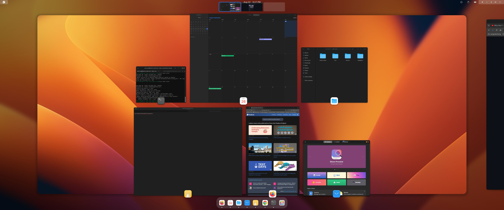

# My Fedora Workstation Setup

This repository contains instructions to set up my [Fedora Workstation](https://fedoraproject.org/) for developing backend/ system software.




## Update the OS

The first thing you should do is go to gnome-software app, add third party repos and update the system to latest's

Next, install common development/software tools:

```bash
-- can install from gnome software
chrome browser \
gnome-tweaks \
extension-manager \
vlc \ 
timeshift
```

Check for firmware updates:

```bash
gnome-software should update firmware
```

## RPM Fusion

Configuration:

[RPM Fusion](https://rpmfusion.org/Configuration)

If using Nvidia:
[RPM Fusion Nvidia How To](https://rpmfusion.org/Howto/NVIDIA?highlight=%28%5CbCategoryHowto%5Cb%29#About_this_Howto)

Improve multimedia:
[RPM Fusion Multimedia how to](https://rpmfusion.org/Howto/Multimedia?highlight=%28%5CbCategoryHowto%5Cb%29)


## Improve Font Rendering and Font look.

1. Run `gnome-tweaks`
1. **Fonts** > **Hinting** > Set to "Full"
1. **Fonts** > **Antialiasing** > Set to "Subpixel (for LCD screens)"

2. Add this line to your ~/.bashrc file to get a 'fatter' look to your fonts:

```bash
export FREETYPE_PROPERTIES="truetype:interpreter-version=35 autofitter:no-stem-darkening=0 cff:no-stem-darkining=0"
```

> Fedora Workstation defaults are: "Slight" for Hinting and "Standard" for Antialiasing, in case you want to switch back.

1. Install better_fonts
   [hyperreal/better_fonts](https://copr.fedorainfracloud.org/coprs/hyperreal/better_fonts/).
2. Set all non monospace font options not monospace to inter, inter can be installed from gnome tweaks.
3. Set monospace font to [JetBrainsMono](https://www.jetbrains.com/lp/mono/).
```bash
wget -P ~/.local/share/fonts https://github.com/ryanoasis/nerd-fonts/releases/download/v3.0.2/JetBrainsMono.zip \
&& cd ~/.local/share/fonts \
&& unzip JetBrainsMono.zip \
&& rm JetBrainsMono.zip \
&& fc-cache -fv
```

## Extensions and settings
1. Disable gnome alert sound in settings -> sound.

Install these extensions using extenison manager:
```
AppIndicator and KStatusNotifierItem Support \
Blur my Shell \
Clipboard Indicator \
Extension List \
Just Perfection \
Hide top bar \
User themes \
Pop Shell - 
Install using this commands:
sudo dnf install -y --setopt=exclude=gnome-shell-extension-pop-shell-shortcut-overrides gnome-shell-extension-pop-shell

```
Extensions configs:

User themes:


1. [Install WhiteSur-gtk-theme](https://github.com/vinceliuice/WhiteSur-gtk-theme)
```
./install.sh -l -c Dark -t blue -N mojave -HD --right --darker --round -i fedora
sudo flatpak override --filesystem=xdg-config/gtk-4.0
sudo ./tweaks.sh -g -c Dark -i apple

From docs install gdm theme

[WhiteSur icon theme](https://github.com/vinceliuice/WhiteSur-icon-theme) - install alt version
[WhiteSur Wallpapers](https://github.com/vinceliuice/WhiteSur-wallpapers)

```


Use gnome tweaks to set themes correctly


Clipboard Indicator:

Use ctrl + shift + v to open clipboard panel in settings.

Just Perfection:

Visibility - Search, Off
Behaviour -  Always show Workspace Switcher, On
Customize - Animation, Fast; Dash icon size = 48 on pc and 40 on laptop

Enable all extensions with extenstion list

